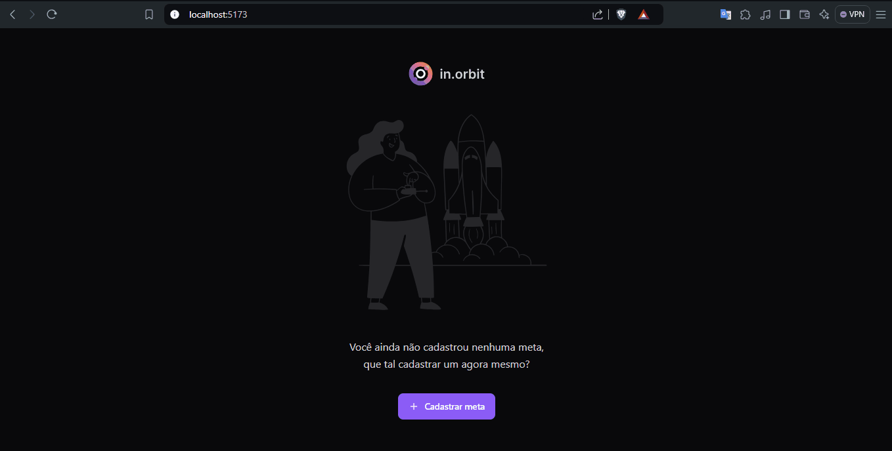

<h1 align="center"> #NLW17 Pocket - Web </h1>

  Esse é mais projeto desenvolvido durante o 17° Next Level Week, evento gratuíto da <a href="https://rocketseat.com.br">Rocketseat</a> 💜 onde desenvolvemos a aplicação in.orbit, que é uma plataforma para gestão de metas pessoais muito massinha e feita com muito carinho.

  <a href="#tecnologias">Tecnologias</a>&nbsp;&nbsp;&nbsp;|&nbsp;&nbsp;&nbsp;
  <a href="#projeto">Projeto</a>&nbsp;&nbsp;&nbsp;|&nbsp;&nbsp;&nbsp;
  <a href="#licenca">Licença</a>&nbsp;&nbsp;&nbsp;|&nbsp;&nbsp;&nbsp;
  <a href="#demonstracao">Demonstração</a>

  

## 🚀 Tecnologias

Esse projeto foi desenvolvido com as seguintes tecnologias:

- Typescript
- ViteJs
- Tailwind CSS
- React Hook Form
- TanStack Query
- Radix UI
- Zod

 

## 💻 Projeto

O in.orbit é um aplicativo feito para criar metas pessoais semanais permitindo que os usuários cadastrem metas, acompanhem o progresso semanal delas, e as marquem como concluídas através de uma interface muito simples e de encher os olhos.

## Licença

Esse projeto está sob a licença MIT.

## Demonstração

 

  

---
